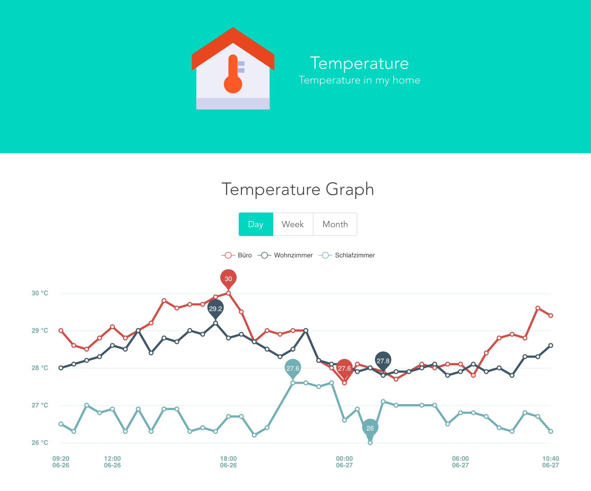

# Temperaute Graph

> A Vue.js and InfluxDB based temperature graph for my Particle.io sensors

This is the frontend repository. The backend is located [here](https://github.com/strebl/home-temperature-backend).



## Build Setup

``` bash
# install dependencies
npm install

# serve with hot reload at localhost:8080
npm run dev

# build for production with minification
npm run build

# build for production and view the bundle analyzer report
npm run build --report
```

For detailed explanation on how things work, checkout the [guide](http://vuejs-templates.github.io/webpack/) and [docs for vue-loader](http://vuejs.github.io/vue-loader).
